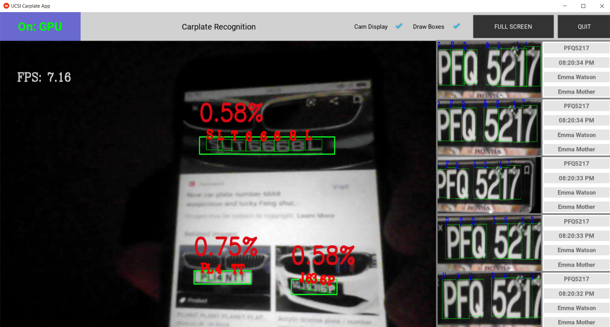
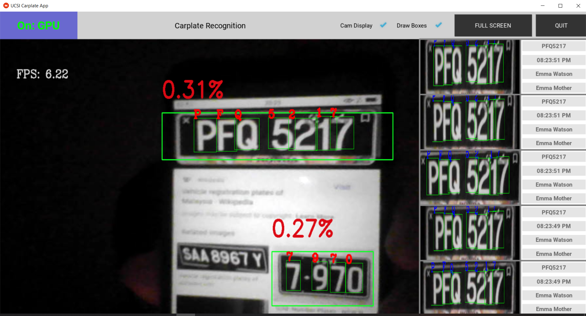
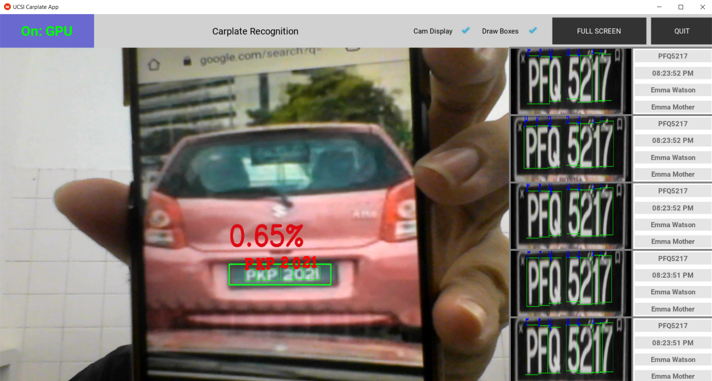

# UCSI ALPR App

---

## Special thanks for the following Github repo
### Source code references:
> LP Detection: https://github.com/CheahWen/ConvALPR

> OCR: https://github.com/sergiomsilva/alpr-unconstrained

> Previously I use this: https://github.com/wechao18/Efficient-alpr-unconstrained, too slow and abandoned already.

---

## App Demo
### Webcam

> 

> 

> 

### Video file

> 

---

# Getting Started

## A) Setup NVIDIA GPU (Optional):
1. Refer Tensorflow GPU setup guide: https://www.tensorflow.org/install/gpu
   
2. Make sure Nvidia Driver, CUDA, CUPTI, CUDNN has been downloaded and installed.
3. Open terminal, type "nvidia-smi" to check NVIDIA Driver have been installed.
   
4. If failed, installation guide of NVIDIA driver in https://helpx.adobe.com/x-productkb/multi/drivers-video-win-nvidia.html
5. Check your environment variables that path of CUDA, CUPTI and CUDNN are added.
6. Open terminal, type "nvcc --version" to check CUDA has been installed.
   
7. If not installed CUDA and CUDNN, Refer TF version and CUDA version compatibility table in https://www.tensorflow.org/install/source#gpu to install.
   
8. - CUDA Download: https://developer.nvidia.com/cuda-toolkit-archive
   - CUDNN Download: https://developer.nvidia.com/rdp/cudnn-archive
   - CUPTI already inside CUDA Package, just make sure to check it if you choose CUDA custom installation.

     > Case if CUDA install fail:
     
        > Refer: https://forums.developer.nvidia.com/t/windows-10-cuda-installation-failure-solved/64389/3
        
        > Choose custom installation

        > Then, unselect:

            > - Visual Studio Integration

            > - Visual Profiler

            > - Nsight System

            > - Nsight Compute

            > - Display Component

            > - Other Component
            
        > It is very tedious to install, previously I choose recommended installation and wasted so much time to figure out and uncheck those stuff.

9. Make sure add in your path like this (I think CUDA will ask you whether adding them in path for you after success installation):
   
10. If you want to setup in Linux Virtualbox, GPU cannot be shared, PCI Passthrough has security risk. Hence it is less possible to get access the NVIDIA GPU.

## B) Step of installation:
1. Make sure Anaconda or Pip is installed
   - Anaconda: https://www.anaconda.com/products/individual
2. Create venv, choose yours:
    - Anaconda: conda create -n YOUR_VENV_NAME python=3.7
    - Pip: virtualenv YOUR_VENV_NAME
3. Activate venv, choose yours:
    - Anaconda: conda activate YOUR_VENV_NAME
    - 
    - Pip: [Linux cmd]: "source YOUR_VENV_NAME/bin/activate", [Window cmd]: ".\YOUR_VENV_NAME\Scripts\activate"
4. Then, install all dependency in requirements.txt.
    - Anaconda & Pip: type "pip install -r requirements.txt", this will work for Anaconda too because it will sync packages installed           from Pip
    
## C) Step of running app:
1. Open WAMP/XAMPP/etc, open Apache server and MySQL.

> As for me, I used XAMPP: 
  
  > Could not start MySQL? Go to `Task Manager>services`, search MySQL and stop it, then start again in XAMPP.

2. Specify source of input in "config.cfg", source can be webcam, video file, image file, IP cam (rstp://) or Mobile IP Webcam (https://).


3. Activate YOUR_VENV.


4. Run "python main.py".


5. If finished, just deactivate env.
   - Pip: simple type "deactivate"
   - Anaconda: simple type "conda deactivate"
     
     
#### Mobile Camera as Input Source 
> IP Webcam Download: https://play.google.com/store/apps/details?id=com.pas.webcam&hl=en&gl=US

> Random Youtube video (How to use IP Webcam): https://youtu.be/2xcUzXataIk

> If failed to connect to PC, try to use your **mobile HOTSPOT**.

> For me, I used my own mobile hotspot, then enter given IP Address: https://192.168.43.1:8080.

> IP Webcam (Interface) [https://192.168.43.1:8080]:
  

> IP Webcam (Full Video) [https://192.168.43.1:8080/video]:
  

> IP Webcam (Interact with GUI) [https://192.168.43.1:8080]:
  


## D) Step of making packaged exe file:
1. In the terminal, run "python compile.py"
2. Move to "**dist**" folder, you will see an exe file.
3. If the **icons** and **models** folder, **config.cfg** and **layout.kv** do not exist in "**dist**" folder, copy that 2 folders and 2 stuff from your main folder into it.
4. Run the exe file, you are good to go.
5. Example "**dist**" folder (or you can copy paste these necessary stuff to other place):
   
---

# Theory

> Originally, I refer to the this paper: https://openaccess.thecvf.com/content_ECCV_2018/papers/Sergio_Silva_License_Plate_Detection_ECCV_2018_paper.pdf

> Then I also found OCR paper in the above paper: https://www.researchgate.net/publication/320677458_Real-Time_Brazilian_License_Plate_Detection_and_Recognition_Using_Deep_Convolutional_Neural_Networks

> You can see how they implement their model (affine transform, data augmentation, YOLO stuff).

> FYI, You Only Look Once (YOLO), a pretrained model using CNN, now got v5 implemented using Pytorch: https://github.com/ultralytics/yolov5.

> But, I only take their OCR model, abandoned car detection and replace lp detection model from this repo: https://github.com/CheahWen/ConvALPR.
   
   > - **LP Detection Model: Tiny YOLOv4 Architecture (22 MB)**

   > - **OCR Model: self-made YOLO (14 Conv Layers) Architecture (17 MB)**

> Model size need to be very small to fight with the speed of processing. The larger model size (>100 MB) usually deploy on the server machine for most company.

## CNN Stuff

Here is some CNN stuff,

> Visualize CNN on predicting handwritten digit: https://www.cs.ryerson.ca/~aharley/vis/conv/


> Recommed Sung Kim course (for absolute beginner): https://www.bilibili.com/video/av71398626/

---

# In case want to deploy on Atlas 200 DK

> Atlas only take TF or caffe model to convert to OM format which is the only compatible model for Ascend chip.

> If want to deploy on Atlas 200 DK, change Darknet weight file to **frozen** TF .pb model.

> I actually have tried to convert frozen model to OM before, but get memory issue on Mind Studio. (I still don't understand how to configure AIPP, what is the right way to parse data, how to process the result in the right way. Every architecture and ML framework has their own way on processing data, no sure if I did something wrong).


## TF To Ascend OM (LP Model)
> "saved_model.pb" is not the right model to convert, their ckpt are separated.

> If the TF graph is not **frozen**, you will get error of model conversion in Mind Studio.
  

> All TF model need to be frozen, I don't know how: https://stackoverflow.com/questions/58119155/freezing-graph-to-pb-in-tensorflow2

> View your model architecture in Netron to check input layer name: https://netron.app/


## Darknet To TF, TF To Ascend OM (OCR Model)

> OCR model is a Darknet model.
  

> I not tried before, refer this: https://prashantdandriyal.medium.com/darknet-to-tensorflow-to-tensorflowlite-b783d55b106a

> Then, make sure it is a frozen model, not a saved model pb.

---

# Get some idea of Kivy
> Kivy docs: https://kivy.org/

> Random Youtube video to get started: https://youtu.be/bMHK6NDVlCM

---

# Get some idea of PyInstaller
> Packaging Kivy App: https://kivy.org/doc/stable/guide/packaging-windows.html

> Stack Overflow: https://stackoverflow.com/questions/37696206/how-to-get-an-windows-executable-from-my-kivy-app-pyinstaller

---

# Files
## Script (Only 9 scripts)
1. ConfigParserManager.py: Read config file and pass the parsed data to respective script.
2. LogManager.py: Record any log.
3. CSVManager.py: Record csv file.
4. videocaptureasync: Handle asynchronous video frame capturing.
5. db.py: Manage database CRUD.
6. lp_det.py: Manage license plate detection stuff.
7. ocr_op.py: Manage any operation of OCR.
8. gui.py: Contain instance of DB object, PlateDetector object, OCR object. Updating UI based on data flow, control all event of GUI.
9. main.py: The starting point of the app. Contain ALPR class object inherit from Kivy App object, update the gui based on clock with fps 60 (```Clock.schedule_interval(self.gui.update, 1.0/60.0)```).

## Layout file: layout.kv
> Declare the Kivy layout for the app.

## Config file: config.cfg
> Store all neccessary configurations.

> You can change app name, app icon, video placeholder image, models path and so on.


---

##### End of Documentation...


